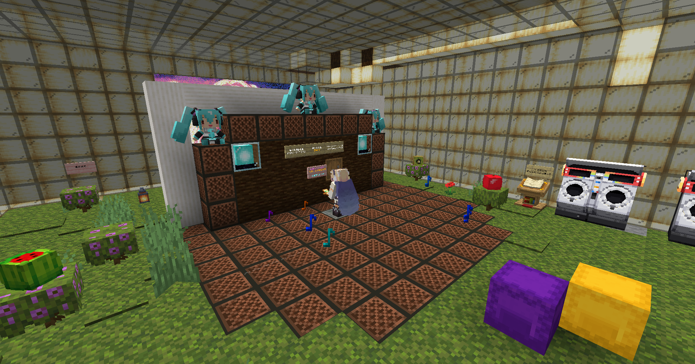
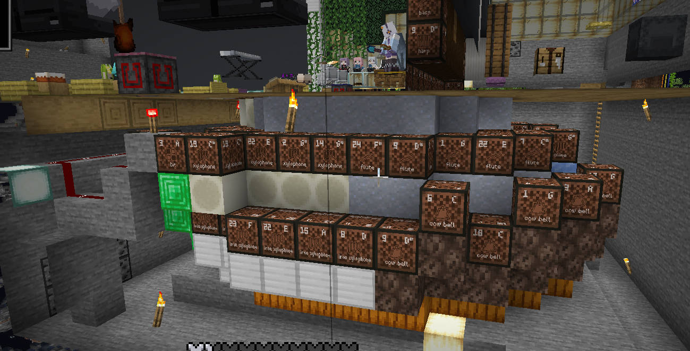

# NyaaNBS

由于NBS开发组声明不官方支持而存在的DiscJockey/Notebot专用NBS曲库。</br>
A NBS library to support DiscJockey/Notebot since NBS dev team decided not to.

此曲库中应当不存在超音域，资源包，音量变更，使用声相，以及变速。如果发现问题请务必提出。</br>
NBS in this library shall not be out-of-ranged, using resourcepacks, adjusting volume/velocity/panning and using tempo changed. If it is, please report.

此文档前半讲解播放插件的使用。</br>
The first half teaches how to use mod for playback。


### Contributor

<a href="https://github.com/Akitsuki4852/NyaaNBS/contributors">

</a>

## 目录 Catalog

- [快速开始 / QuickStart](#快速开始--quickstart)
- [游戏中使用 / Usage](#游戏中使用--usage)
- [排疑解难 / Trouble Shoot](#排疑解难--trouble-shoot)<br><br>
- [额外注意事项 / Additional Notice](#额外注意事项--additional-notice)
- [声明 / Statement](#声明-statement)

## 快速开始 / QuickStart

⬇️ **下载本库曲包 / Download This library:**

<div align="center">
  <a href="https://github.com/Akitsuki4852/NyaaNBS/archive/refs/heads/main.zip">
    
  </a>
</div>

<details><summary>高级用户 / Advanced Users (Git)</summary>

```bash
git clone https://github.com/Akitsuki4852/NyaaNBS.git
```

</details>

<details><summary>其他曲库 / Other Collections</summary>

- [**NBS-Files**](https://github.com/CursedBM81/NBS-Files): A song library converted directly from MIDI by the author.
- [**nbs**](https://github.com/TheInfamousAlk/nbs): The largest notebot-lib.

</details>

</br>
---

📂 **收集所有NBS文件 / Collect All NBS Files:**

在 `nbs.handcrafted` 文件夹中提供了一个实用工具 `collect_all_nbs.bat`：</br>
A utility script `collect_all_nbs.bat` is provided in the `nbs.handcrafted` folder:

- 双击运行即可将当前以及子文件夹中所有的.nbs文件收集到 `_collected_nbs`文件夹中
- Double-click to collect all .nbs files from all subfolders into `_collected_nbs` folder
- 这对于批量复制到游戏目录很有帮助
- This is helpful for bulk copying to your game directory
- 你也可以只在想要的分区里使用
- You may also only run it in the category folder wanted

---

⚙️ **安装模组 / Mod to install:**

**[ModMenu](https://modrinth.com/mod/modmenu) + [DiscJockey](https://www.curseforge.com/minecraft/mc-mods/disc-jockey)**</br>
or **[MeteorClient](https://meteorclient.com/)** </br>

> 注意彗星端是挂端。请合规使用。<br>
> To be warned MeteorClient is a hacked client. Please use in compliance.

---

📂 **曲库位置 / Where to put songs**

> .minecraft/config/discjockey/songs/ -songs.nbs

> .minecraft/meteor-client/notebot/ -songs.nbs

NBS (如果你想编曲 if you want to arrange yourself)

**Note Block Studio** https://noteblock.studio/

## 游戏中使用 / PlayBack

<details><summary> DiscJockey User</summary>
如果使用非原版交互距离音乐盒，在Mod Menu模组设定中找到”期望版本“，选择1.20.5+ </br>
If using non-vanilla-reach MusicBox, find "expected version" in Mod Menu config, select 1.20.5+
进入音乐盒明显标识的中心点，使用/DiscJockey 或 J键 (可更改)打开模组面板，选择前面提到的已经搬运进文件夹的.nbs文件，点击播放。</br>
Stand inside the expected position in MusicBox, open DJ panel with /DiscJockey or J key (Changable), select your desired .nbs file, play and enjoy.

</details>
<details><summary> Notebot User</summary>
进入音乐盒明显标识的中心点，打开Notebot的选曲界面，选择前面提到的已经搬运进文件夹的.nbs文件，立即播放。</br>
Stand inside the expected position in MusicBox, open notebot panel in your Client, select your desired .nbs file, play and enjoy.
</details>

## 舞台搭建指南 / Stage Buildup



核心原则：只需要让所有音符盒位于玩家交互范围内且可以发声。如何摆放只影响视听体验与范围内的最大放置数量 </br>
Core Principle: Ensure every noteblock is reachable by player and is playable. How it is placed only matters for how it sounds and the max noteblock number in range.

你可以使用MiniHud根据以下参数画球体划出范围： </br>
You can use MiniHud Mod to draw the range ball with following data:

- Player Camera Height: +1.6
- Vanilla Reach: 5.5

一些播放器投影: </br>
Some disco ball schematics:

(update next time.)

<!--
- vanilla reach : (there is a better one, update next time.)
- +1.2 reach : [Jukebox1.2v1](./schematics/Jukebox1.2v1.litematic)
- +3.6 reach : (there is a better one, update next time.)
-->

## 排疑解难 / Trouble Shoot

一些你可能会遇到的问题: </br>
Some problem you might encounter:

<details><summary>缺少音色 Missing Timbre</summary>

- 请检查是否需要交互距离工具。请检查是否打开DJ mod 1.20.5+选项。如未发现问题请检查音乐盒投影。
- Check if you need a tool for increasing your reach. Check if you had opened DJ mod 1.20.5+ config. If so please verify musicbox using provided schmetic.

</details>
<details><summary>游戏崩溃 Crash:</summary>

- 不要使用DJ mod播放含有自定义乐器的.nbs。不要在空白曲库点击随机播放。
- Do not use customized instrument with DJ mod. Do not click random play with empty music library.

</details>

<details><summary>听起来怪怪的 Sounds Weird?</summary>

- 检查nbs内是否有超音域音符，右上角一键去除。
- Check and remove out of range notes in your .nbs file, click top right corner in NBS.

</details>
<details><summary>发包超出限制踢出。 Kicked by sending package too freq.</summary>

- 视乎服务器限制。建议换一份nbs。
- Depends by server, just skip this nbs.

</details>
<details><summary>播放时音符盒不见了 Noteblock Disappearing?</summary>

- 不要手持斧头进行播放。请立即停止并维修。
- Do not use axe for playing. Stop and repair your musicbox.

</details>

## 额外注意事项 / Additional Notice

> 此曲库中应当不存在超音域，资源包，音量变更，使用声相，以及变速。如果发现问题请务必提出。
> NBS in this library shall not be out-of-ranged, using resourcepacks, adjusting volume/velocity/panning and using tempo changed. If it is, please report.

<details><summary>如果你想用于红石音乐 (中文) </summary>
请注意，本曲库中的所有 .nbs 文件均基于**原版 Minecraft 音符盒的音域，音色平衡以及 Notebot 无音量控制**等限制进行编排。为了适应这些限制，编曲过程中会有大量妥协，包括但不限于**和弦转位的不精确、音色替换，甚至舍弃副旋律、琶音、音效或鼓点声部**。尽管这些文件在理论上可用于红石音乐，但在实际使用前，请务必考虑并自查以下要点：

1. 生存模式建造

> 红石信号以 2 游戏刻（约 0.1 秒）为一个刻进行触发。请选用 100 BPM、150 BPM、200 BPM 或它们的倍数/近似值, 否则无法实现。

2. 创造模式建造

> 您**不受notebot的无音量限制**：编曲中通过调整音符盒摆放密度来替代部分声部音量，但你可以选择控制距离来实现音部音量平衡而非密度；还可采用[**立体声**](https://www.bilibili.com/video/BV1Mw91YmEgJ/)布局等高级手法。

> 您**可以使用自定义资源包**：可加载 [**NoteBetter**](https://github.com/chsbuffer/NoteBetter) 等资源包，打破原版音域限制，更可以将音符盒替换为**其他任意乐器音源**。

> 您**可以使用命令方块**：可利用 **/playsound** 直接播放音源文件，实现类似 MIDI 播放器的效果。

如果您在评估以上方案后，仍坚持 **“仅/tickrate 更变的原教旨主义红石音乐”** 架构，也可一键生成本曲库中的 .nbs 文件，但这**并不会让您真正掌握红石音乐的创作技巧**。

</details>

<details><summary>As if you want to use for redstone music (英文)</summary>

Please note that all .nbs files in this library are **arranged under vanilla Minecraft note-block constraints—limited pitch range, instrument balance, and Notebot’s lack of volume control**. To fit within these boundaries, the arrangements make significant compromises, including **imprecise chord voicings, instrument substitutions, and even the omission of secondary melodies, arpeggios, sound-effect layers, or drum parts**. Although these files can theoretically be used for redstone music, you should carefully consider the following before proceeding:

1. Survival-Mode Builds

> Redstone signals fire every 2 GameTicks (approximately 0.1 seconds). To stay in sync with /tickrate, choose **100 BPM, 150 BPM, 200 BPM—or their multiples or near-values—** otherwise correct playback cannot be achieved.

2. Creative-Mode Builds

> You are **no longer bound by Notebot’s no-volume control**: the original arrangements use note-block density to simulate part volume, but you can instead balance volumes via distance. You can also employ [**advanced techniques**](https://youtu.be/CejiPtUKeTE).

> **Custom resource packs allowed**: load [**NoteBetter**](https://github.com/chsbuffer/NoteBetter) or similar packs to break vanilla pitch limits, or **replacing note-block sounds with any instrument sample**.

> **Command blocks allowed**: use **/playsound** to play soundfont files directly and build a MIDI-style track.

If, after reviewing the above options, you still insist on a **“pure, /tickrate only vanilla redstone music”** approach, you can auto-generate these .nbs files—but it won’t teach you any genuine redstone music composition techniques.

</details>

## 声明 Statement

### 资源中立性声明 / Neutrality Statement

本资源库仅作为音乐文件共享平台，不代表维护者支持或认可任何原创作者的政治倾向、立场及观点。使用者应对内容自行判断。</br>
This repository serves solely as a music file sharing platform. It does not represent the maintainer's endorsement of any original authors' political tendencies, positions or viewpoints. Users shall exercise independent judgment regarding content appropriateness.

### 版权响应 / Copyright Compliance

所有文件版权归属原作者及权利人。收到版权方正式通知后，我们将在48小时内移除争议内容。侵权通知请提交至：akitsuki4852@gmail.com</br>
All files belong to their respective copyright holders. Upon receiving formal notice from rights owners, we will remove disputed content within 24 hours. Submit DMCA requests to: akitsuki4852@gmail.com

### 无担保声明 / No Warranty

资源按"现状"提供，维护者不承诺：

- 音色与游戏版本的永久兼容性
- 文件完全无版权争议
- 资源存储的永久可用性

Resources provided "AS IS" with no warranties:

- Permanent compatibility with game versions
- Complete absence of copyright disputes
- Permanent availability of resources

### 使用者责任 / User Responsibility

使用者需确保：

- 遵守服务器插件政策（如禁止Notebot）
- 不将资源用于商业盈利

Users shall ensure:

- Compliance with server plugin policies (e.g. Notebot restrictions)
- Non-commercial usage

### 免责条款 / Limitation of Liability

维护者不对以下情况：

- 因使用资源导致的账号封禁
- 文件下载引发的系统安全问题

Maintainers not liable for:

- Account bans caused by resource usage
- System security issues from file downloads

### 协议变更权 / Terms Modification

我们保留随时更新本声明的权利，恕不另行通知。</br>
We reserve the right to modify these terms at any time without prior notice.

## License

[](http://creativecommons.org/licenses/by-nc/4.0/)

This work is licensed under a [Creative Commons Attribution-NonCommercial 4.0 International License](http://creativecommons.org/licenses/by-nc/4.0/).

使用规则 / Usage Terms:
✅ 可以分享，改编 / Share and adapt
✅ 必须署名 / Must give credit
❌ 禁止商业用途 / No commercial use

详细条款请见 [CONTRIBUTING.md](./CONTRIBUTING.md) / See [CONTRIBUTING.md](./CONTRIBUTING.md) for details.

