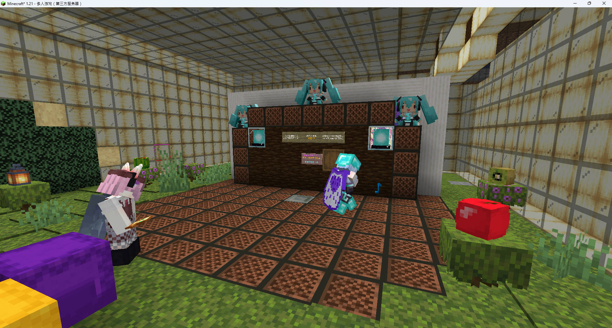
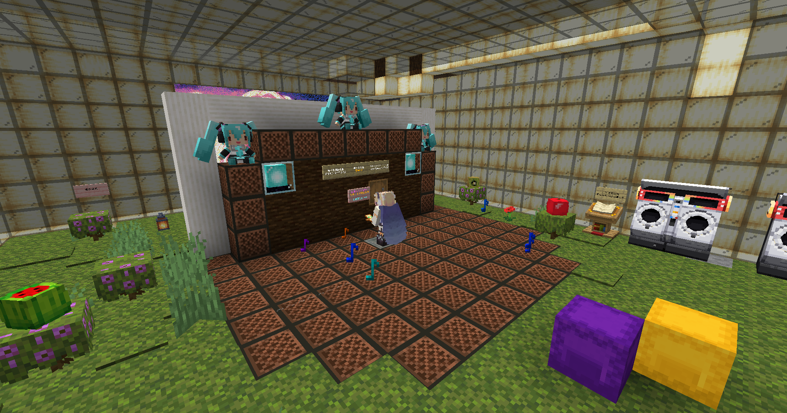
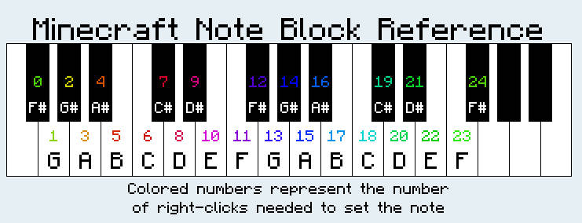
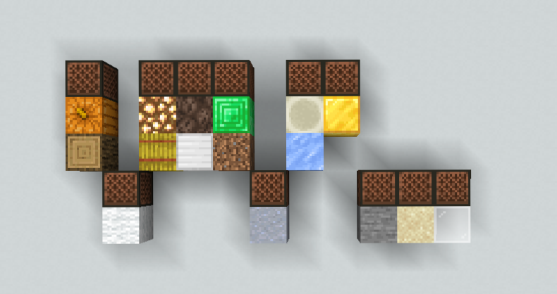
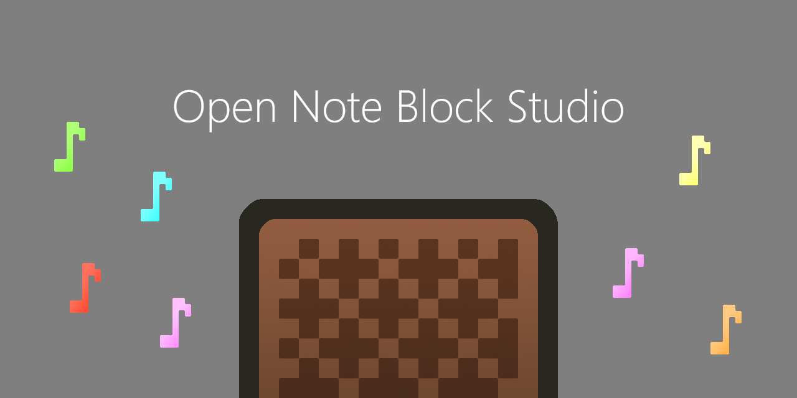
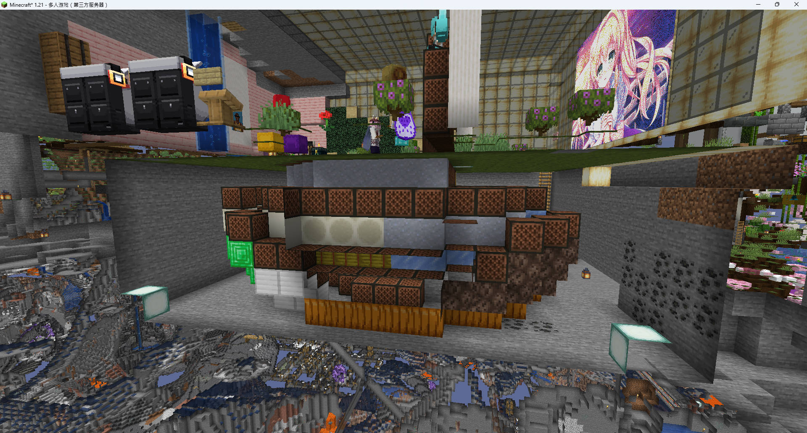

# NyaaNBS


专为1.14+版本16音色设计的NBS曲库以及对应音乐盒，使用DiscJockey/Notebot模组。

Specifically designed 16 Timbre NBS and MusicBox collection, broadcast using DiscJockey/Notebot.





## 目录 Catalog
- [快速开始 / QuickStart](#-快速开始--quickstart)
- [游戏中使用 / Usage](#游戏中使用--usage)
</br></br>
- [音符盒入门 / Basic Noteblock](#音符盒入门--basic-noteblock)
- [舞台搭建指南 / Build Stage](#舞台搭建指南--stage-buildup)
- [排疑解难 / Trouble Shoot](#排疑解难--trouble-shoot)
- [贡献指南 / Contribution](#贡献指南--contribution)
- [许可证 / License](#许可--license)

## ⚡ 快速开始 / QuickStart

1. **获取NBS文件 / GetNBS**
   ```bash
   (win+R, "cmd")
   git clone https://github.com/Akitsuki4852/NyaaNBS.git
2. **模组配置 / ModConfig**

    安装模组 / install:
    - DiscJockey: https://www.curseforge.com/minecraft/mc-mods/disc-jockey
    - 或 or
    - 使用任意挂端的 [Notebot](https://github.com/Victormeriqui/Notebot) </br>
        Use [Notebot](https://github.com/Victormeriqui/Notebot) function in ANY Hacked Client

    -> .minecraft/mods/
3. **DiscJockey**

    MerryChristmas.nbs </br>
    -> .minecraft/config/discjockey/songs/
4. **HackedClient**

    -> .minecraft/***client/notebot/

## 游戏中使用 / Usage




1. **DiscJockey**
    
    如果使用非原版交互距离音乐盒，在模组设定中找到”期望版本“，选择1.20.5+ </br>
    If using non-vanilla-reach MusicBox, find "expected version" in config, select 1.20.5+ 

    进入音乐盒明显标识的中心点，使用/DiscJockey 或 J键 (可更改)打开模组面板，选择前面提到的已经搬运进文件夹的.nbs文件，立即播放。</br>
    Stand inside the expected position in MusicBox, open DJ panel with /DiscJockey or J key (Changable), select your desired .nbs file, play and enjoy.

2. **Notebot**

    进入音乐盒明显标识的中心点，打开Notebot的选曲界面，选择前面提到的已经搬运进文件夹的.nbs文件，立即播放。</br>
    Stand inside the expected position in MusicBox, open notebot panel in your Client, select your desired .nbs file, play and enjoy.
    


## 音符盒入门 / Basic Noteblock


中字: 数字代表右键点击次数



- F#3 ~ F#5
- F#4 ~ F#6
- F#5 ~ F#7
- F#6 ~ F#8
- F#7 ~ F#9
- Drum, Snare/Clash/Hit, Hit/Hat/Click

[音符盒声音视频](https://www.bilibili.com/video/BV1hg411M79C) </br>
[Plays Noteblock Sound](https://www.youtube.com/watch?v=NnpAHacl_Mc)

- - -



Download Link:
[OpenNBS](https://github.com/OpenNBS/NoteBlockStudio)


## 舞台搭建指南 / Stage Buildup


核心原则：确保所有音符盒位于玩家交互范围内。 </br>
Core Principle: Ensure every noteblock is reachable by player.

你可以使用MiniHud根据以下参数画球体划出范围： </br>
You can use MiniHud Mod to draw the range ball with following data:

- Player Camera Height: +1.6
- Vanilla Reach: 4.5

推荐将相同方块聚集摆放，且将南瓜/灵魂沙/萤石/浮冰堆放到较远离观众方向。</br>
It is recommanded to place same blocks together, while pumpkin/soulsand/glowstone/ice parts stay in the side away from audiences.

推荐使用提供的投影: </br>
Recommand using our provided schematics:

- vanilla reach : [Jukebox0.0v2](./schematics/Jukebox0.0v2.litematic)
- +1.2 reach : [Jukebox1.2v1](./schematics/Jukebox1.2v1.litematic)
- +3.6 reach : [Jukebox3.6v2](./schematics/Jukebox3.6v2.litematic)

## 排疑解难 / Trouble Shoot

一些你可能会遇到的问题: </br>
Some problem you might encounter:

- 缺少音色 Missing Timbre:

    - 请检查是否需要交互距离工具。请检查是否打开DJ mod 1.20.5+选项。如未发现问题请检查音乐盒投影。
    - Check if you need a tool for increasing your reach. Check if you had opened DJ mod 1.20.5+ config. If so please verify musicbox using provided schmetic.

- 游戏崩溃 Crash:
    - 不要使用DJ mod播放含有自定义乐器的.nbs。不要在空白曲库点击随机播放。
    - Do not use customized instrument with DJ mod. Do not click random play with empty music library.

- 听起来怪怪的 Sounds Weird?
    - 检查nbs内是否有超音域音符，右上角一键去除。
    - Check and remove out of range notes in your .nbs file, click top right corner in NBS.

- 发包超出限制踢出。 Kicked by sending package too freq.
    - 视乎服务器限制。建议换一份nbs。
    - Depends by server, just skip this nbs.

- 播放时音符盒不见了 Noteblock Disappearing?
    - 不要手持斧头进行播放。请立即停止并维修。
    - Do not use axe for playing. Stop and repair your musicbox.

- 想在别的服播 play in other server?
    - 非常欢迎，这里的nbs是开源的。
    - Welcome, these nbs are open sourced.


## 贡献指南 / Contribution

欢迎通过Pull Request提交
- 无版权争议&高质量&可以脚本播放的.nbs
    - [类型]曲名.nbs
- 改进的音符盒排列方案.schematic
- 文档翻译/错误修正/重新规范曲库命名/重新排列曲库分类

Welcome contribution with pr:
- Mod playable high quality .nbs without copyright disputes
    - [type]name.nbs
- improved musicbox design.schemetic
- text correction/organize and standardize the music library

## 许可 / License
GNU General Public License v3.0。

